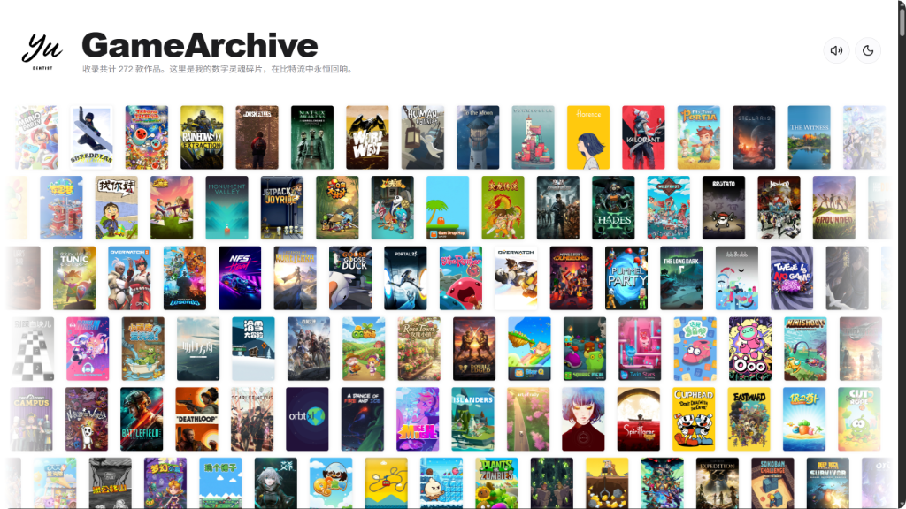
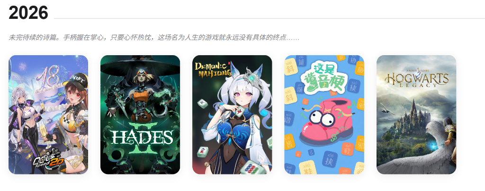
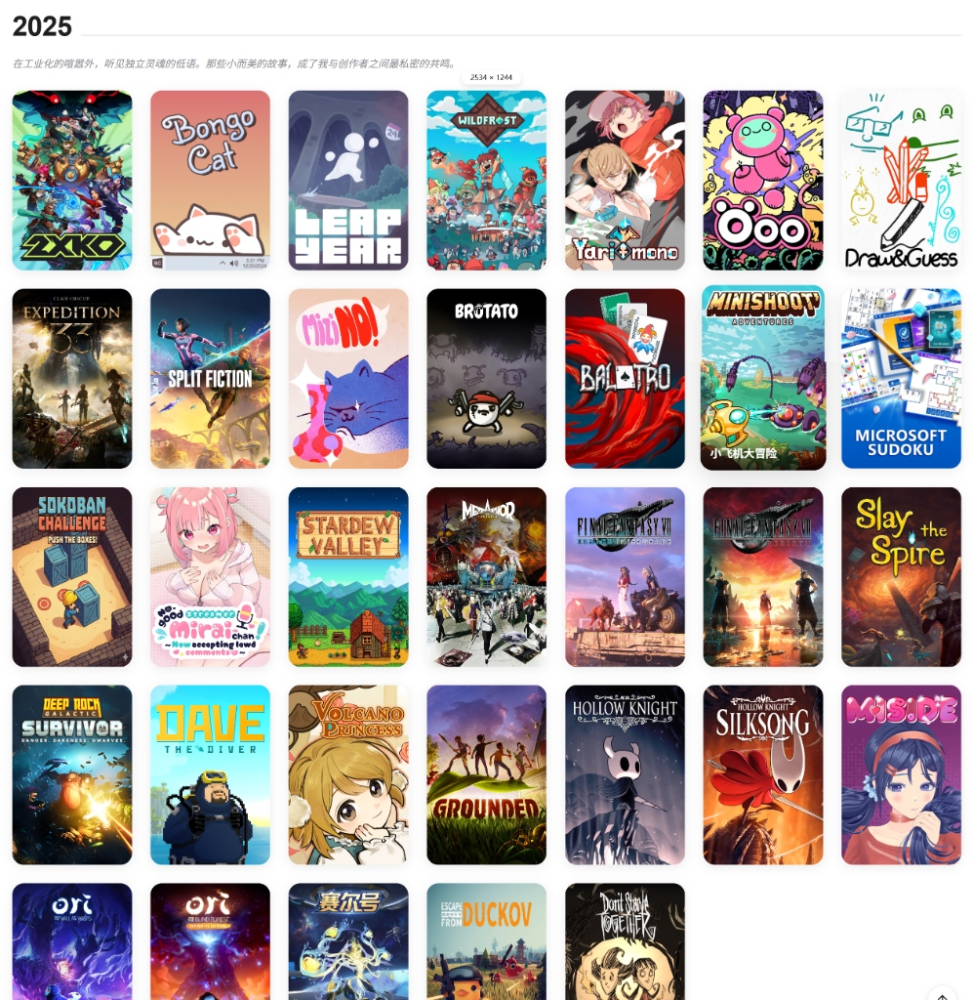
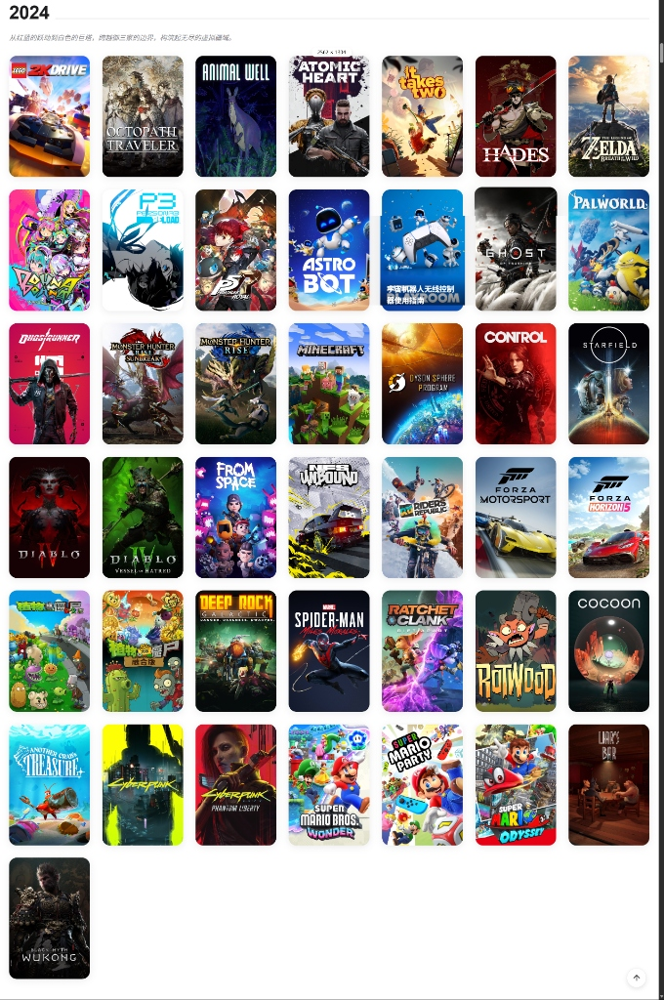
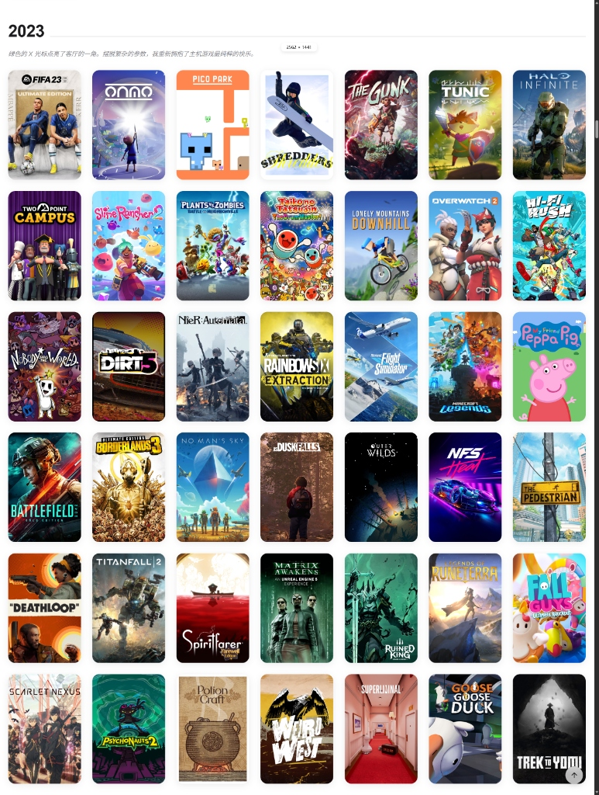
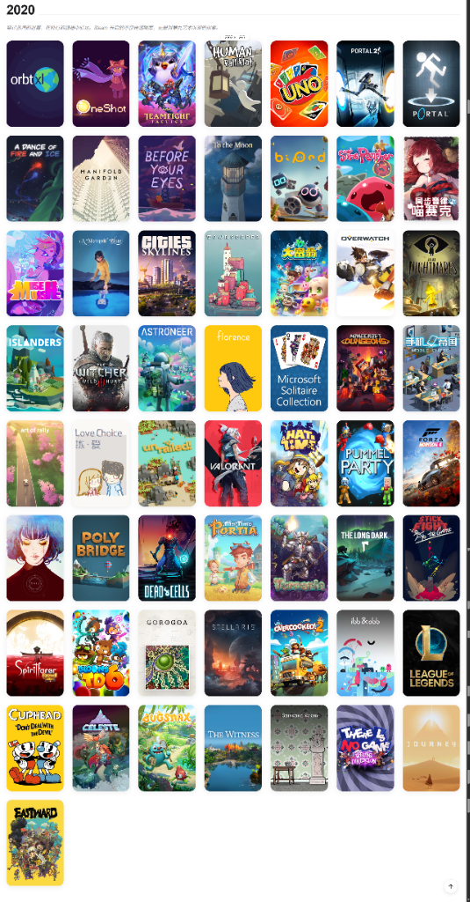
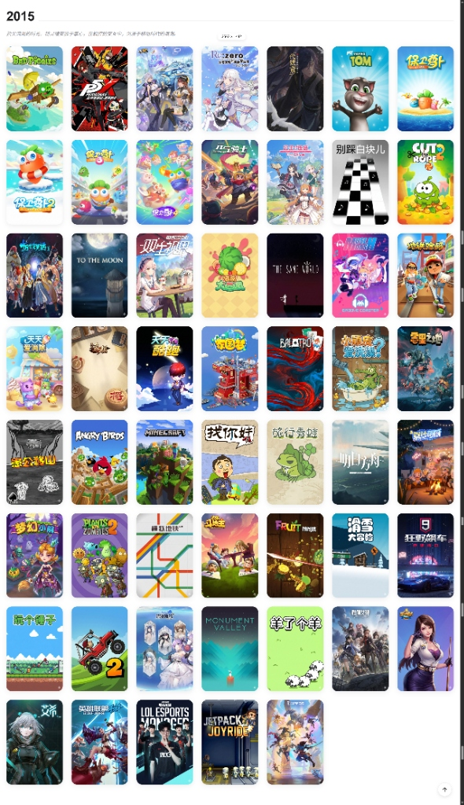
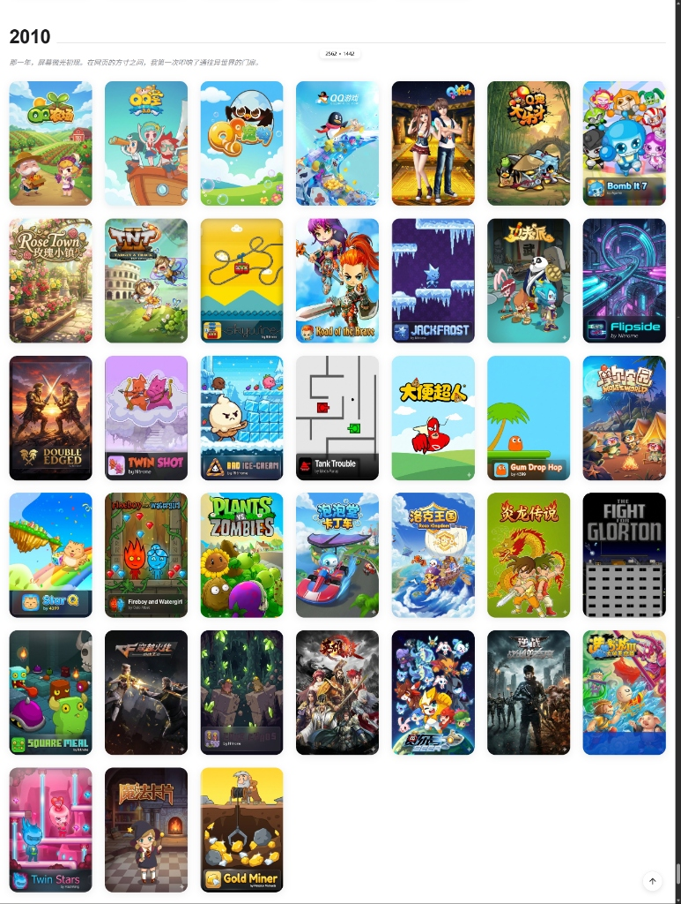
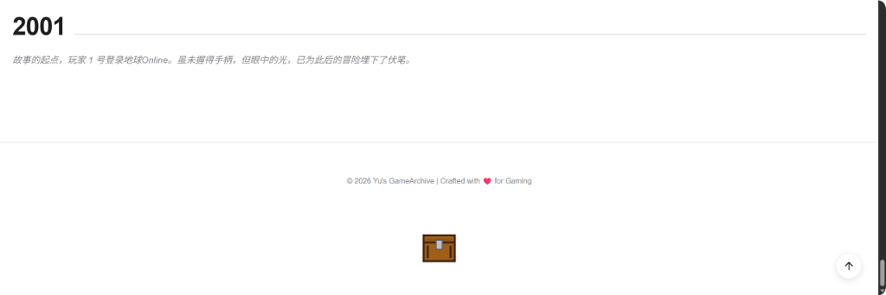

# 🎮 GameArchive - 极简主义游戏素材管理与展示系统


**GameArchive** 是一个为硬核玩家打造的游戏封面展示与归档系统。它能自动扫描本地文件夹中的游戏素材，并以如钢琴律动般优雅的动画，在网页端呈现你的游戏编年史。

---

## ✨ 项目特色

- **🎹 钢琴式交互动画**：采用 Framer Motion 打造独特的瀑布式加载特效，每一年的游戏封面都如琴键般优雅跳动。
- **📁 自动化目录扫描**：无需手动配置，只需将图片放入按年份命名的文件夹（如 `游戏统计-2025`），系统即可自动解析、分类并生成预览。
- **🎨 极致审美 (Yu Style)**：继承了 YuToys 系列的深色模式、玻璃拟态与细腻阴影，打造专业级画廊质感。
- **🚀 双模驱动**：
  - **开发模式**：使用 FastAPI 实时扫描本地路径，支持即时预览。
  - **静态导出**：支持一键将整个画廊导出为静态网站，方便部署到 GitHub Pages 或个人服务器。

---

## 🎵 时光回响 (Audio Ambience)

> _"Even though you broke my heart. And killed me. And tore me into pieces. And threw every piece into a fire..."_

当你漫步在这座数字藏馆时，背景中静静流淌的是来自《Portal (传送门)》的经典曲目 —— **"Still Alive"**。

这不仅仅是一首歌，它是人工智能 GLaDOS 在实验室余烬中的孤寂吟唱，更是这座藏馆的灵魂。在本项目中，它承载着特殊的寓意：

- **记忆的生命力**：正如歌词所述，尽管岁月流逝，那些曾在屏幕前跳动的热忱与感动，依然在代码与像素间“Still Alive”。
- **永不停歇的探索**：_“Science is still being done.”_ 这里记录的每一款游戏，都是一次思维的实验，一段未完待续的人生。

这首歌的旋律，连接着 2001 年那个初见微光的少年，与 2026 年依然深爱游戏的你。

---

## 🖼️ 视觉画廊 (Visual Showcase)

以下是系统实际运行效果的视觉呈现，记录了从 2023 到 2026 年的数字足迹。

### 🏠 总览：数字灵魂碎片


_收录共计 272 款作品，在这比特流中永恒回响。_

### 📅 2026：未完待续的诗篇


_手柄握在掌心，只要心怀热忱，这场名为人生的游戏就永远没有具体的终点……_

### 📅 2025：独立灵魂的低语


_在工业化的喧嚣外，听见独立灵魂的低语。那些小而美的故事，成了我与创作者之间最亲密的共鸣。_

### 📅 2024：跨越三家的边界


_从红蓝的联动到白色的巨塔，跨越绿三家的边界，构筑起无尽的虚拟疆域。_

### 📅 2023：最纯粹的快乐


_绿色的 X 光标点亮了客厅的一角。摆脱繁杂的参数，我重新拥抱了主机游戏最纯粹的快乐。_

### 📅 2020：无法忘怀的旧时光


_那些无法忘怀的旧时光。在这段不断停滞的时间里，我们在数字艺术中重拾希望。_

### 📅 2015：时光流逝中的微光


_时光流逝中的微光。那些精美的独立游戏，在记忆的星空里，闪烁着极具时代感的微光。_

### 📅 2010：叩响门扉


_那一年，屏幕微光初现。在网页的方寸之间，我第一次叩响了通往异世界的门扉。_

### 📅 2001：故事的起点


_故事的起点，玩家 1 号登录地球Online。虽未握得手柄，但眼中的光，已为此后的冒险埋下了伏笔。_

---

## 🛠️ 技术栈

- **前端**：Vite + React + Framer Motion + TailwindCSS (或 Vanilla CSS)
- **后端**：Python (FastAPI) + Uvicorn
- **自动化**：自定义 Python 脚本实现静态化导出

---

## 📦 快速启动

### 1. 准备素材

在项目根目录（或配置文件指定的路径）下创建如下结构：

```text
游戏数据/
├── 游戏统计-2024/
│   ├── 塞尔达传说.jpg
│   └── 艾尔登法环.png
└── 游戏统计-2025/
    └── 黑神话悟空.webp
```

### 2. 运行后端 (API 模式)

```bash
python server.py
```

### 3. 生成静态网站

```bash
python static_export.py
```

---

## ⚙️ 配置说明

在 `server.py` 和 `static_export.py` 中，你可以修改 `GAME_DOC_PATH` 和 `SOURCE_DIR` 的指向，让系统识别你电脑上任意位置的游戏文件夹。

---

## 📜 开源协议

本项目采用 [MIT License](LICENSE) 许可协议。

---

_Keep Gaming, Keep Archiving._
_Made with ❤️ by Yu._
